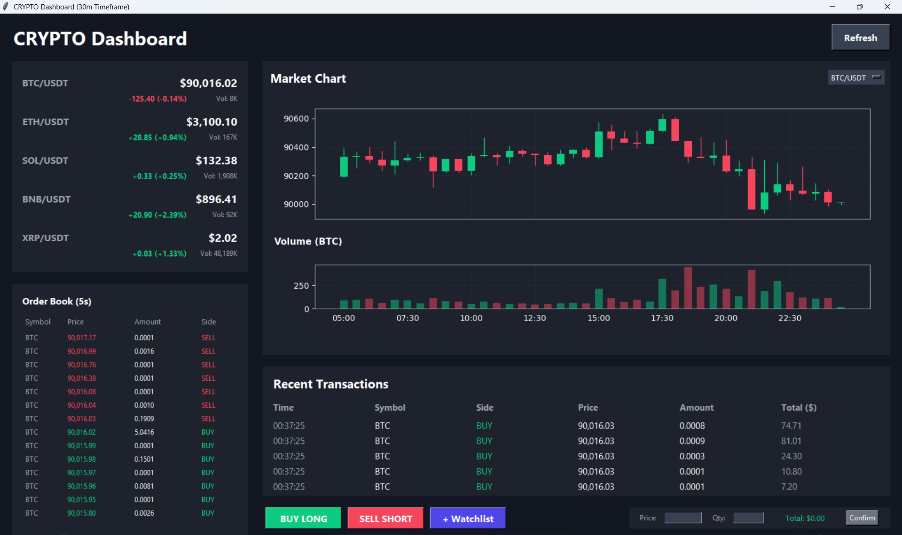

# 🚀 Cryptocurrency Dashboard

## 📌 Project Overview

This project demonstrates the application of **Object-Oriented Programming (OOP)** and **Event-Driven Programming** concepts in Python through the development of a real-time cryptocurrency dashboard.



The dashboard focuses on:

* 📡 Streaming **live market data** (prices, trades, order books) via **WebSockets**
* 📊 Visualizing **historical price data** using **REST APIs** from **Binance**

---

## 📁 Project Structure

> ✅ The structure below reflects the actual folder layout and how modules are connected at runtime.

```text
crypto_dashboard/
│
├── main.py                # Main application entry point
├── README.md              # Project documentation
├── requirements.txt       # Project dependencies
│
├── components/            # UI component classes
│   ├── __init__.py        # Marks components as a Python package
│   ├── ticker.py          # Watchlist / price ticker panel
│   ├── orderbook.py       # Order book panel
│   ├── chart.py           # Candlestick chart panel
│   ├── history.py         # Trade history panel
│   └── controls.py        # Buy / Sell simulation controls
│
└── utils/                 # Configuration and utility modules
    ├── __init__.py        # Marks utils as a Python package
    └── config.py          # Color themes and font settings
```

---

## 🔗 Module Connectivity & Data Flow

The application follows a **central controller architecture**:

* `main.py` creates the **CryptoApp** object
* `CryptoApp` initializes all UI panels from the `components` package
* WebSocket and REST API data are received in background threads
* Incoming data is dispatched to the appropriate panel via update methods

**Data Flow Example:**

```
Binance WebSocket
        ↓
    CryptoApp
        ↓
┌───────────────┬───────────────┬───────────────┐
│ Watchlist     │ OrderBook     │ TradeHistory  │
│ Panel         │ Panel         │ Panel         │
└───────────────┴───────────────┴───────────────┘
```

This design ensures:

* Loose coupling between UI components
* Clear separation of responsibilities
* Easy scalability for new panels or features

---

## 🧩 Design Overview (OOP Structure)

### 1. `CryptoApp` Class (Main Controller)

Responsibilities:

* Initializes the **Tkinter main window**
* Creates and manages all UI components
* Starts background threads for API requests
* Handles **WebSocket connections** and event callbacks
* Dispatches real-time data to UI panels

---

### 2. `WatchlistPanel` Class

Represents the **price ticker / watchlist** section.

**Key Method:**

* `update_data(symbol, price, volume, percent_change)`

  * Updates price values in real time
  * Changes text color based on price movement (green/red)

---

### 3. `ChartPanel` Class

Responsible for rendering historical price data using **Matplotlib**.

**Key Method:**

* `draw_chart(chart_data, symbol)`

  * Draws **candlestick charts** (Open, High, Low, Close)
  * Displays volume bars
  * Uses a **30-minute timeframe** per candle

---

### 4. `OrderBookPanel` Class

Displays the **market depth** (bids and asks).

**Key Method:**

* `update_data(symbol, bids, asks)`

  * Updates the top **7 bid and ask levels** in real time
  * Receives data directly from WebSocket streams

---

### 5. `TradeHistoryPanel` Class

Displays the **most recent executed trades**.

Features:

* Continuously updates as new trades arrive
* Shows price, quantity, and trade side

---

### 6. `ControlPanel` Class

Handles user interaction for simulated trading.

**Key Features:**

* 🟢 **BUY LONG** and 🔴 **SELL SHORT** buttons
* 🧮 Automatic calculation of **total order value**
* ⚡ Auto-fills current market price
* 📦 Displays confirmation popup for each action

---

## 🚀 Features

* **Real-Time Data Streaming** using `websocket-client`
* **Event-Driven Architecture** for live updates
* **Object-Oriented Design** with modular UI components
* **Multithreading** to keep the GUI responsive
* **Rich Data Visualization**, including:

  * Live price indicators (green/red)
  * Candlestick charts
  * Order book depth tables
  * Recent trade history

---

## 🧪 Testing Strategy

All core features were manually tested to verify correct behavior:

| Feature           | Test Method                          | Expected Result                      | Status |
| ----------------- | ------------------------------------ | ------------------------------------ | ------ |
| Watchlist Ticker  | Observe left panel after launch      | Prices update with color indicators  | PASSED |
| Candlestick Chart | Observe top-right panel              | Candles and volume render correctly  | PASSED |
| Order Book        | Observe bottom-left panel            | Top 7 bids/asks update in real time  | PASSED |
| Recent Trades     | Observe bottom-right panel           | Trades update continuously           | PASSED |
| Symbol Switching  | Change trading pair (e.g., ETH/USDT) | All panels update correctly          | PASSED |
| Control Panel     | Submit Buy/Sell order                | Total calculated, popup shown        | PASSED |
| Graceful Shutdown | Close application window             | Threads and WebSockets close cleanly | PASSED |

---

## ▶️ How to Run the Application

1. Ensure **Python 3.x** is installed
2. Install dependencies:

```bash
pip install -r requirements.txt
```

> **Note:** `tkinter` is usually bundled with Python. If installation errors occur, remove it from `requirements.txt`.

3. Open a terminal in the project directory
4. Run the application:

```bash
python main.py
```

---


## 🔮 Future Improvements

We are constantly working to improve the user experience. Here is the roadmap for upcoming features:

- [ ] **Responsive UI & Scrollbars:** Implement a scrollable main container to allow window resizing without hiding content, ensuring the dashboard remains usable on smaller screens.
- [ ] **User Preferences:** Save user settings (active watchlist, theme, window layout) locally so they persist after restarting the application.
- [ ] **Multiple Timeframes:** Add support for customizable chart intervals (e.g., 15m, 1h, 4h, 1D) instead of the fixed 30m timeframe.

## 📝 Notes

* This project is intended for **educational purposes only**
* Buy/Sell functionality is a **simulation** and does **not** execute real trades
